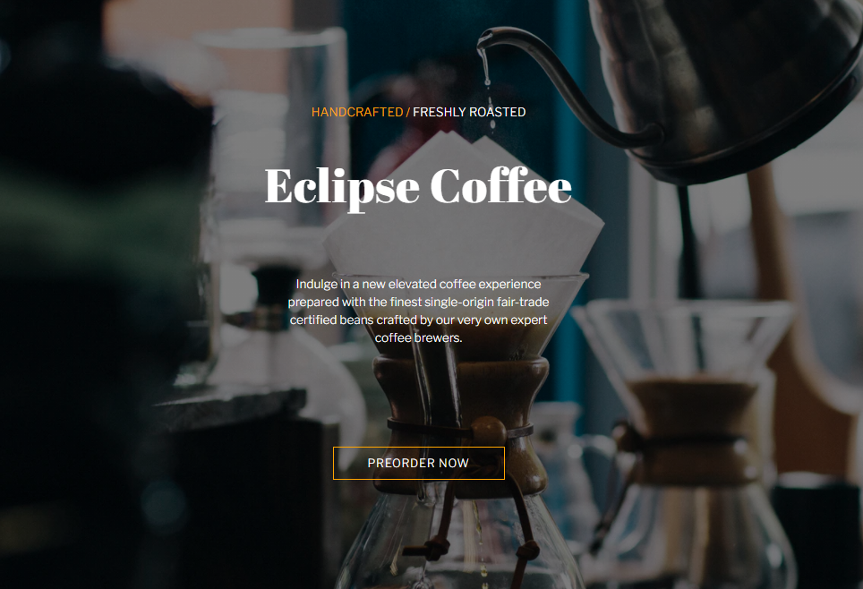
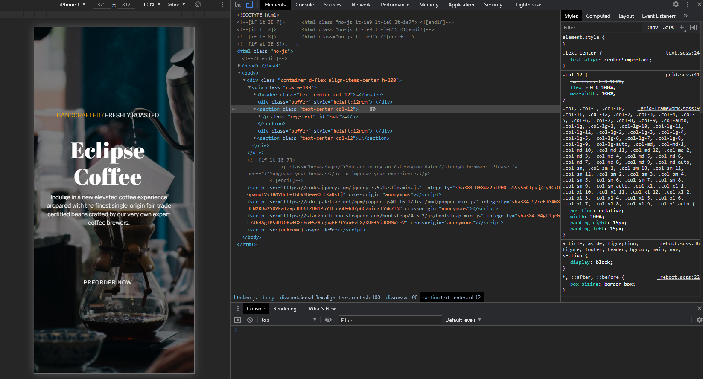

## Overview
In this project, I created a simple landing page using CSS Bootstrap. 

### What is Boostrap?
Boostrap is a framework that can help you design websites really quickly. It includes HTML and CSS based design templates for most, if not all, web page elements like forms, buttons, tables, navigation bars, images, etc. Moreover, another well-liked feature of Bootstrap is: it is responsive under the hood, which makes designing web pages for various screen sizes a breeze. 

> Bootstrap is the most popular HTML, CSS, and JS framework for 
> developing responsive, mobile first projects on the web.

### Advantages of Using Bootstrap:
1. **Very Little Learning Curve**

Bootstrap is easy to set up and configure. It has a pretty good documentation that allows you to get started right away. 

2. **Compatible with Most Browsers**

Besides being responsive by default, using Bootstrap can save you the headache of cross-browser bugs. It helps you design web pages that are consistent across browsers and screen sizes. 

3. **Good Design Practice**

There's a reason why Bootstrap has been at the top of frontend development frameworks. It looks nice even when using it right out-of-the-box. Using Bootstrap allows you to implement design layouts that follow good design practices that without doubt looks pleasing to the eyes.

### Disadvantages of Using Bootstrap:
1. **Can Bloat Your Website**

Since it is a framework involving a bunch of scripts and styling you might not entirely need, it can bloat your website and affect your load times. 

2. **Hard to Standout Without Further Customization**

If you don't implement styling customization, chances are you would see another web site that looks like yours. 

## What I did: 
Actually, this is not my first time implementing Bootstrap to create landing pages. Bootstrap has been around for a long time. Since I've been putting off studying web development for years now, I always have to revisit HTML + CSS basics which includes some Bootstrap exercise. 

Arguably, I can say that the most difficult aspect in styling (not just in Bootstrap) is alignment, specifically: center align. To manage this, I made use of the `d-flex` the Bootstrap class that allows you to transform **direct children elements** into flex items. 

To organize other elements vertically, I just made use of Bootstrap's Grid, having each line as a single full row. 

To make it look nice, I made use of a high resolution image from Unsplash and utilized color schemes similar to that of the background image. Typography pairing can also be employed to make text content look appealing. 

```html
<body>
    <div class="container d-flex align-items-center h-100">
        <div class="row w-100">
            <header class="text-center col-12">
                <p class="reg-text"><span class="em-text">HANDCRAFTED / </span> FRESHLY ROASTED</p>
                <br>
                <h1>Eclipse Coffee</h1>
            </header>
            <div class="buffer" style="height:12rem"> </div>
            <section class="text-center col-12">
                <p class="reg-text" id="sub">
                    Indulge in a new elevated coffee experience prepared with the finest single-origin fair-trade certified beans crafted by our very own expert coffee brewers.
                </p>
            </section>

            <div class="buffer" style="height:12rem"> </div>
            <section class="text-center col-12">
                <a href="www.google.com">
                    <div class="btn-xl"> PREORDER NOW </div>
                </a>
            </section>
        </div>

    </div>
```
## Check it out:
- [Bootstrap Coffeeshop Landing Page](http://bootstrap-coffee-shop.decoroustea.xyz/)
- [Github Link](https://github.com/tristanjoshuaalba/sandboxwd/tree/master/coffeeShop)

<div className="Image__Small">
  
</div>

<div className="Image__Small">
  
</div>


## Helpful References:
- [Bootstrap 3.4 Documentation](https://getbootstrap.com/docs/3.4/)


<!-- ## Headers

# H1

It is recommended to NOT use H1s as it is reserved for the article heading. Any H1 is set as an H2.

## H2

### H3

#### H4

##### H5

###### H6

## Emphasis

Emphasis, aka italics, with _asterisks_ or _underscores_.

Strong emphasis, aka bold, with **asterisks** or **underscores**.

Combined emphasis with **asterisks and _underscores_**.

Strikethrough uses two tildes. ~~Scratch this.~~

## Lists

1. First ordered list item
2. Another item
3. Actual numbers don't matter, just that it's a number

- Unordered list can use asterisks

* Or minuses

- Or pluses

## Links

[I'm an inline-style link](https://www.google.com)

[I'm an inline-style link with title](https://www.google.com "Google's Homepage")

[I'm a reference-style link][arbitrary case-insensitive reference text]

[I'm a relative reference to a repository file](../blob/master/LICENSE)

[You can use numbers for reference-style link definitions][1]

Or leave it empty and use the [link text itself].

URLs and URLs in angle brackets will automatically get turned into links.
http://www.example.com or <http://www.example.com> and sometimes
example.com (but not on Github, for example).

Some text to show that the reference links can follow later.

[arbitrary case-insensitive reference text]: https://www.mozilla.org
[1]: http://slashdot.org
[link text itself]: http://www.reddit.com

## Images

<div className="Image__Small">
  
</div>

Lorem Ipsum is simply dummy text of the printing and typesetting industry. Lorem Ipsum has been the industry's standard dummy text ever since the 1500s, when an unknown printer took a galley of type and scrambled it to make a type specimen book. It has survived not only five centuries, but also the leap into electronic typesetting, remaining essentially unchanged. It was popularised in the 1960s with the release of Letraset sheets containing Lorem Ipsum passages, and more recently with desktop publishing software like Aldus PageMaker including versions of Lorem Ipsum. Lorem Ipsum is simply dummy text of the printing and typesetting industry.

## Code and Syntax Highlighting

```javascript
var s = "JavaScript syntax highlighting";
alert(s);
```

```
No language indicated, so no syntax highlighting.
But let's throw in a <b>tag</b>.
```

### JSX

```jsx
import React from "react";
import { ThemeProvider } from "theme-ui";
import theme from "./theme";

export default props => (
  <ThemeProvider theme={theme}>{props.children}</ThemeProvider>
);
```

## Blockquotes

Lorem Ipsum is simply dummy text of the printing and typesetting industry. Lorem Ipsum has been the industry's standard dummy text ever since the 1500s, when an unknown printer took a galley of type and scrambled it to make a type specimen book. It has survived not only five centuries, but also the leap into electronic typesetting, remaining essentially unchanged. It was popularised in the 1960s with the release of Letraset sheets containing.

> Blockquotes are very handy in email to emulate reply text.
> This line is part of the same quote.

Lorem Ipsum is simply dummy text of the printing and typesetting industry. Lorem Ipsum has been the industry's standard dummy text ever since the 1500s, when an unknown printer took a galley of type and scrambled it to make a type specimen book. It has survived not only five centuries, but also the leap into electronic typesetting, remaining essentially unchanged. It was popularised in the 1960s with the release of Letraset sheets containing Lorem Ipsum passages, and more recently with desktop publishing software like Aldus PageMaker including versions of Lorem Ipsum

## Horizontal Rule

Horizontal Rule

Three or more...

---

Lorem Ipsum is simply dummy text of the printing and typesetting industry. Lorem Ipsum has been the industry's standard dummy text ever since the 1500s, when an unknown printer took a galley of type and scrambled it to make a type specimen book. It has survived not only five centuries, but also the leap into electronic typesetting, remaining essentially unchanged. It was popularised in the 1960s with the release of Letraset sheets containing Lorem Ipsum passages, and more recently with desktop publishing software like Aldus PageMaker including versions of Lorem Ipsum

---

Lorem Ipsum is simply dummy text of the printing and typesetting industry. Lorem Ipsum has been the industry's standard dummy text ever since the 1500s, when an unknown printer took a galley of type and scrambled it to make a type specimen book. It has survived not only five centuries, but also the leap into electronic typesetting, remaining essentially unchanged. It was popularised in the 1960s with the release of Letraset sheets containing Lorem Ipsum passages, and more recently with desktop publishing software like Aldus PageMaker including versions of Lorem Ipsum -->
