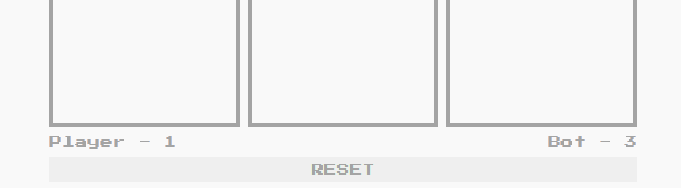

## Overview
At this point, I just finished going over the HTML/CSS and the Basic JavaScript section of [Andrei Neagoie's Zero To Mastery Web Development Course](https://academy.zerotomastery.io/p/complete-web-developer-zero-to-mastery). I was thinking of an exercise where I can apply all I have learned so far. I didn't want to do boring JS problems so I opted for a fun tictactoe game.  

### How do you play Tic Tac Toe?

<div className="Image__Small">
  
</div>
Quoting [Exploratorium.edu](https://www.exploratorium.edu/brain_explorer/tictactoe.html) explanation:

1. The game is played on a grid that's 3 squares by 3 squares.

2. You are X, your friend (or the computer in this case) is O. Players take turns putting their marks in empty squares.

3. The first player to get 3 of her marks in a row (up, down, across, or diagonally) is the winner.

4. When all 9 squares are full, the game is over. If no player has 3 marks in a row, the game ends in a tie.

> Tic-Tac-Toe (along with a lot of other games) involves looking ahead and trying 
> to figure out what the person playing against you might do next.

## The Design: 
### 1. Creating the skeleton 
Before I get to styling and logic of the game, I try to think first what are the most bare elements the app needs to have to function properly, keeping in mind (if I can) ways to make it *extensible*. 

What do I mean by coding something and making it extensible? For example, in a TicTacToe game, an obvious skeleton structure would be to create a grid of 3x3 squares. However, you can also code it in such a way it can expand to let's say 4x4 or 5x5 depending on the underlying logic and controls you will add later. 

Since this is just a side project that I was doing for fun, I resorted to the default TicTacToe game structure. 

As you can see below, I made use of 3 `div` elements I styled using `class = "grid-wrapper"`. Under each element, I create 3 boxes with `class = "box zone"`.

```html
<body>
    <div class="buffer"></div>
    <h1> The Impossible </h1>
    <h1> Tic Tac Toe</h1>
    <h3> By dcoroustea34</h3>
    <!-- <br> -->
    <div class="grid-wrapper">
        <div class="box zone" onclick="pickMe(0)" id="1"></div>
        <div class="box zone" onclick="pickMe(1)" id="2"></div>
        <div class="box zone" onclick="pickMe(2)" id="3"></div>
    </div>


    <div class="grid-wrapper">
        <div class="box zone" onclick="pickMe(3)" id="4"></div>
        <div class="box zone" onclick="pickMe(4)" id="5"></div>
        <div class="box zone" onclick="pickMe(5)" id="6"></div>
    </div>


    <div class="grid-wrapper">
        <div class="box zone" onclick="pickMe(6)" id="7"></div>
        <div class="box zone" onclick="pickMe(7)" id="8"></div>
        <div class="box zone" onclick="pickMe(8)" id="9"></div>
    </div>

    <!-- <br> -->
    <div class="container">
        <div id="player"> Player - <span id="player-score">0</span></div>
        <div id="bot"> Bot - <span id="bot-score">0</span></div>
    </div>
    <!-- <br> -->
    <button onclick="resetGame()"> RESET </button>

    <!--[if lt IE 7]>
            <p class="browsehappy">You are using an <strong>outdated</strong> browser. Please <a href="#">upgrade your browser</a> to improve your experience.</p>
        <![endif]-->

    <script src="script.js" async defer></script>
</body>
```

### 2. Outlining Logic Requirements
Before I start writing out logic and wrapping up the skeleton HTML structure, I make sure I take into account all the possible logic the game has to have to work seamlessly. For a TicTacToe game, I enumerated the following:
1. Picking a Box (or Position)
2. Bot picking a Box
3. Checking if there's a Winning Player
4. Resetting a Game
5. Keeping Tabs of Score

### 3. Writing out the Logic
So to power up everything, I made use of mouseEvents JavaScript DOM to trigger logic. 

I won't paste everything here, you can check out the Github repo instead. But here's `pickMe()` function I made use in the skeleton HTML above:

```javascript
function pickMe(a) {
    var element = document.getElementsByClassName("zone");
    element[a].classList.add("selected");
    element[a].style.pointerEvents = 'none';
}

const allBoxes = document.querySelectorAll('.zone');

// Wait for mouse clicks
allBoxes.forEach(function(a) {
    a.addEventListener('click', function() {
        pseudoAI();
    })
})

```

### 4. Styling the Elements
Here's the fun part. 

So to make the game look nice and lively, I opted to make use of GIFs versus opting for just background color. Furthermore, I made use of class name toggles so everytime a logic is triggered an element (box) can change background to whatever animated GIF I set. 


## Check it out:
- [The Impossible TicTacToe](http://tictactoe.decoroustea.xyz/)
- [Github Link](https://github.com/tristanjoshuaalba/sandboxwd/tree/master/tictactoe)

## Screenshots:
### Fun GIFs are used to mark player positions.
<div className="Image__Small">
  
</div>

### The game includes a built-in score keeping feature and a reset button.
<div className="Image__Small">
  
</div>

### Also, fun GIFs when you win a game.
<div className="Image__Small">
  
</div>

### Still, fun GIFs when you lose a game.
<div className="Image__Small">
  
</div>

## Helpful References:
- [w3schools DOM Events](https://www.w3schools.com/jsref/dom_obj_event.asp)

<!-- My first post using `@narative/gatsby-theme-novela`. Novela is built by the team at [Narative](https://narative.co), and built for everyone that loves the web.

## Headers

# H1

It is recommended to NOT use H1s as it is reserved for the article heading. Any H1 is set as an H2.

## H2

### H3

#### H4

##### H5

###### H6

## Emphasis

Emphasis, aka italics, with _asterisks_ or _underscores_.

Strong emphasis, aka bold, with **asterisks** or **underscores**.

Combined emphasis with **asterisks and _underscores_**.

Strikethrough uses two tildes. ~~Scratch this.~~

## Lists

1. First ordered list item
2. Another item
3. Actual numbers don't matter, just that it's a number

- Unordered list can use asterisks

* Or minuses

- Or pluses

## Links

[I'm an inline-style link](https://www.google.com)

[I'm an inline-style link with title](https://www.google.com "Google's Homepage")

[I'm a reference-style link][arbitrary case-insensitive reference text]

[I'm a relative reference to a repository file](../blob/master/LICENSE)

[You can use numbers for reference-style link definitions][1]

Or leave it empty and use the [link text itself].

URLs and URLs in angle brackets will automatically get turned into links.
http://www.example.com or <http://www.example.com> and sometimes
example.com (but not on Github, for example).

Some text to show that the reference links can follow later.

[arbitrary case-insensitive reference text]: https://www.mozilla.org
[1]: http://slashdot.org
[link text itself]: http://www.reddit.com

## Images

<div className="Image__Small">
  
</div>

Lorem Ipsum is simply dummy text of the printing and typesetting industry. Lorem Ipsum has been the industry's standard dummy text ever since the 1500s, when an unknown printer took a galley of type and scrambled it to make a type specimen book. It has survived not only five centuries, but also the leap into electronic typesetting, remaining essentially unchanged. It was popularised in the 1960s with the release of Letraset sheets containing Lorem Ipsum passages, and more recently with desktop publishing software like Aldus PageMaker including versions of Lorem Ipsum. Lorem Ipsum is simply dummy text of the printing and typesetting industry.

## Code and Syntax Highlighting

```javascript
var s = "JavaScript syntax highlighting";
alert(s);
```

```
No language indicated, so no syntax highlighting.
But let's throw in a <b>tag</b>.
```

### JSX

```jsx
import React from "react";
import { ThemeProvider } from "theme-ui";
import theme from "./theme";

export default props => (
  <ThemeProvider theme={theme}>{props.children}</ThemeProvider>
);
```

## Blockquotes

Lorem Ipsum is simply dummy text of the printing and typesetting industry. Lorem Ipsum has been the industry's standard dummy text ever since the 1500s, when an unknown printer took a galley of type and scrambled it to make a type specimen book. It has survived not only five centuries, but also the leap into electronic typesetting, remaining essentially unchanged. It was popularised in the 1960s with the release of Letraset sheets containing.

> Blockquotes are very handy in email to emulate reply text.
> This line is part of the same quote.

Lorem Ipsum is simply dummy text of the printing and typesetting industry. Lorem Ipsum has been the industry's standard dummy text ever since the 1500s, when an unknown printer took a galley of type and scrambled it to make a type specimen book. It has survived not only five centuries, but also the leap into electronic typesetting, remaining essentially unchanged. It was popularised in the 1960s with the release of Letraset sheets containing Lorem Ipsum passages, and more recently with desktop publishing software like Aldus PageMaker including versions of Lorem Ipsum

## Horizontal Rule

Horizontal Rule

Three or more...

---

Lorem Ipsum is simply dummy text of the printing and typesetting industry. Lorem Ipsum has been the industry's standard dummy text ever since the 1500s, when an unknown printer took a galley of type and scrambled it to make a type specimen book. It has survived not only five centuries, but also the leap into electronic typesetting, remaining essentially unchanged. It was popularised in the 1960s with the release of Letraset sheets containing Lorem Ipsum passages, and more recently with desktop publishing software like Aldus PageMaker including versions of Lorem Ipsum

---

Lorem Ipsum is simply dummy text of the printing and typesetting industry. Lorem Ipsum has been the industry's standard dummy text ever since the 1500s, when an unknown printer took a galley of type and scrambled it to make a type specimen book. It has survived not only five centuries, but also the leap into electronic typesetting, remaining essentially unchanged. It was popularised in the 1960s with the release of Letraset sheets containing Lorem Ipsum passages, and more recently with desktop publishing software like Aldus PageMaker including versions of Lorem Ipsum -->
