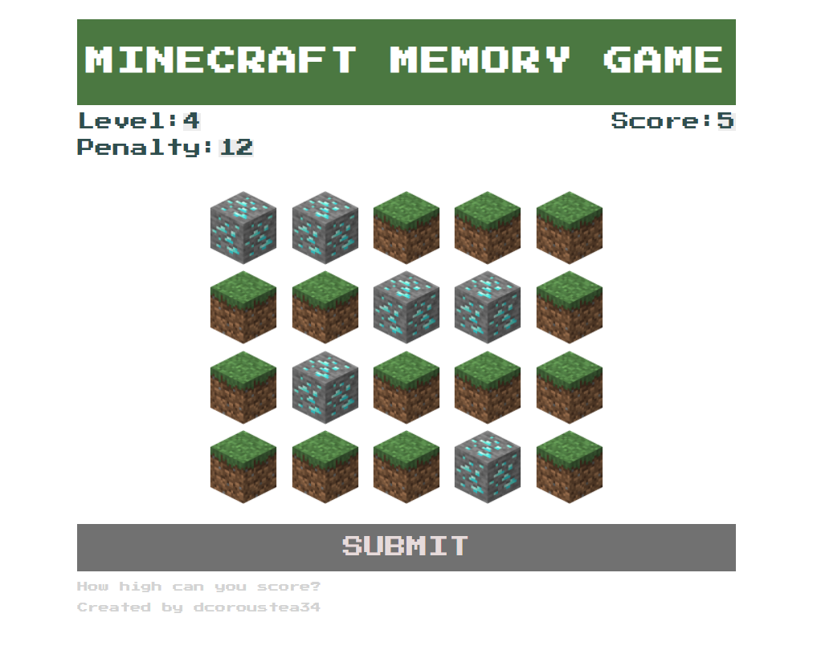
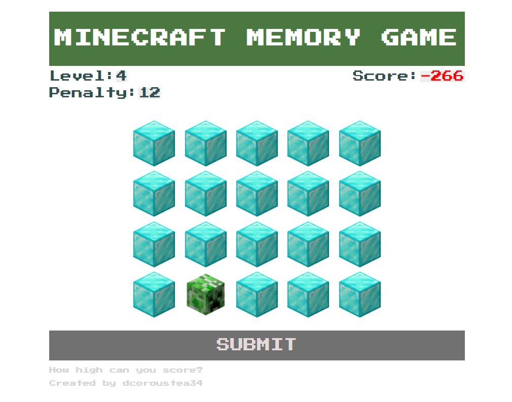
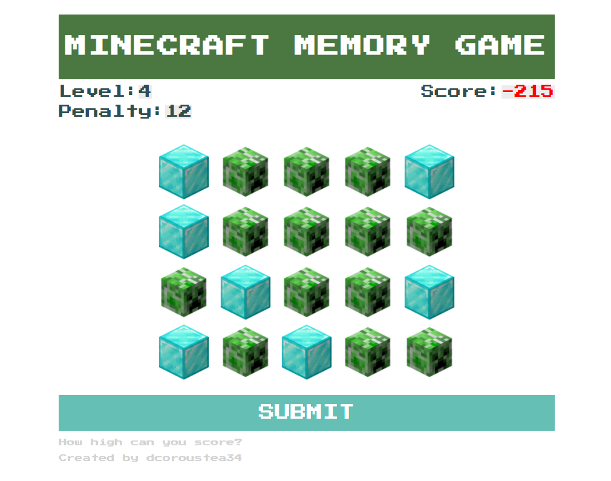
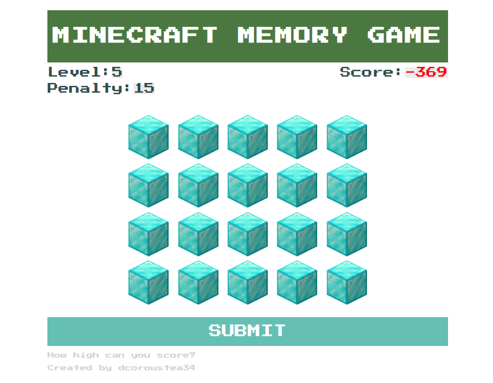
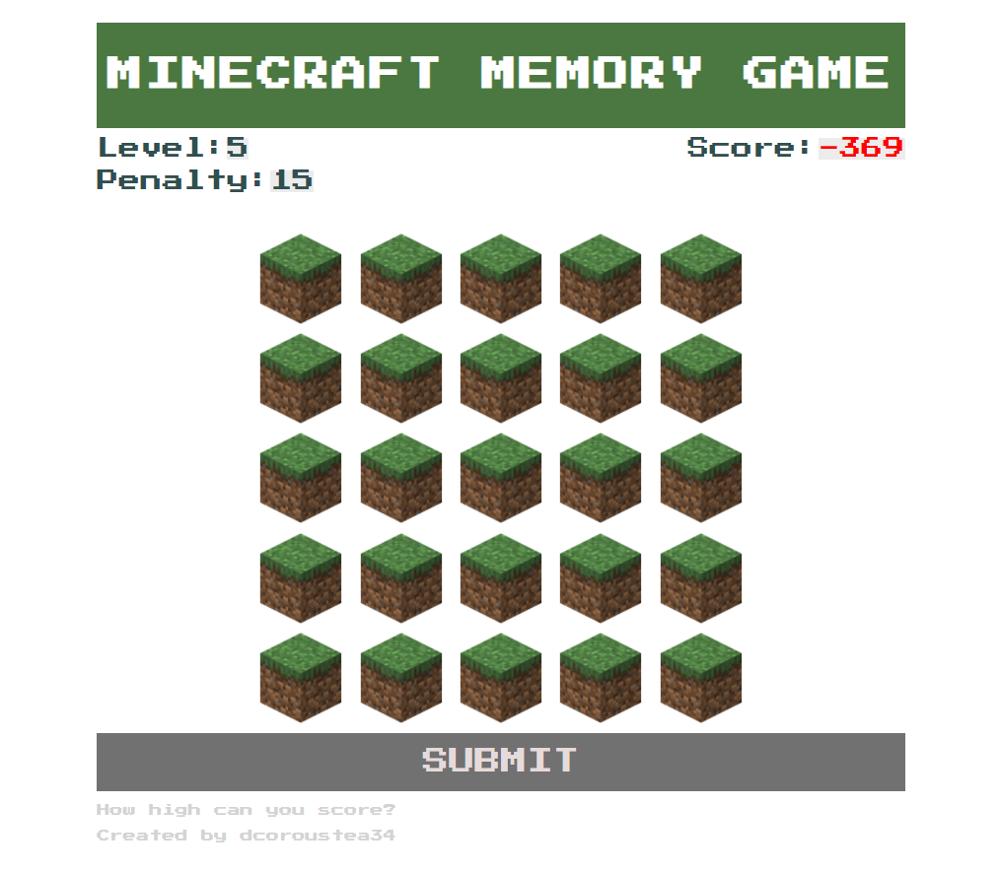

## Overview
Back when I was in highschool, I took a class on C++ and as our final project, we have to create an app and present it to class. What I created then was a memory game. Too bad I don't have the source files anymore, but I remember playing it on the console and was fun. Although admittedly, it was too basic and the logic to make it dynamically challenging wasn't there. (I hardcoded the patterns)

In this project, I try to recreate the memory game I made before using HTML, CSS, and JS. 

### Game Mechanics

## The Design: 
### 1. Creating the skeleton 

### 2. Outlining Logic Requirements

### 3. Writing out the Logic

### 4. Styling the Elements
 

## Check it out:
- [Minecraft Memory Game](http://memory-game.decoroustea.xyz/)
- [Github Link](https://github.com/tristanjoshuaalba/sandboxwd/tree/master/memoryGame)

## Screenshots:
### I used Minecraft visuals to make the game fun and more relatable to young audience. 
By the way, it's super convenient to make use of Minecraft blocks since they're edgy and perfect for grid layout and styling.
<div className="Image__Small">
  
</div>

### When you make a mistake, your errors turn into creeper blocks. 
Creepers are one of many zombie types in Minecraft, and they are quite annoying because they explode when you approach them. 
<div className="Image__Small">
  
</div>

### Also, you get a penalty when you make mistakes.
The penalty is a function of the number of blocks you didn't get correctly and the level you are in.
<div className="Image__Small">
  
</div>

### This is what it looks like when you get everything right.
If you are not familiar, those are **diamond** blocks which are quite rare in the game. 
<div className="Image__Small">
  
</div>

### You get another layer of blocks to memorize everytime you level up.
The game is actually expandable in such a way we can set infinite number of layers. *But, who would want to play that?*
<div className="Image__Small">
  
</div>

## Helpful References:
- [Minecraft Blocks Wiki](https://minecraft.fandom.com/wiki/Blocks)


<!-- It's 2:47PM and I'm changing this file to make a new commit. 
My first post using `@narative/gatsby-theme-novela`. Novela is built by the team at [Narative](https://narative.co), and built for everyone that loves the web.

## Headers

# H1

It is recommended to NOT use H1s as it is reserved for the article heading. Any H1 is set as an H2.

## H2

### H3

#### H4

##### H5

###### H6

## Emphasis

Emphasis, aka italics, with _asterisks_ or _underscores_.

Strong emphasis, aka bold, with **asterisks** or **underscores**.

Combined emphasis with **asterisks and _underscores_**.

Strikethrough uses two tildes. ~~Scratch this.~~

## Lists

1. First ordered list item
2. Another item
3. Actual numbers don't matter, just that it's a number

- Unordered list can use asterisks

* Or minuses

- Or pluses

## Links

[I'm an inline-style link](https://www.google.com)

[I'm an inline-style link with title](https://www.google.com "Google's Homepage")

[I'm a reference-style link][arbitrary case-insensitive reference text]

[I'm a relative reference to a repository file](../blob/master/LICENSE)

[You can use numbers for reference-style link definitions][1]

Or leave it empty and use the [link text itself].

URLs and URLs in angle brackets will automatically get turned into links.
http://www.example.com or <http://www.example.com> and sometimes
example.com (but not on Github, for example).

Some text to show that the reference links can follow later.

[arbitrary case-insensitive reference text]: https://www.mozilla.org
[1]: http://slashdot.org
[link text itself]: http://www.reddit.com

## Images

<div className="Image__Small">
  
</div>

Lorem Ipsum is simply dummy text of the printing and typesetting industry. Lorem Ipsum has been the industry's standard dummy text ever since the 1500s, when an unknown printer took a galley of type and scrambled it to make a type specimen book. It has survived not only five centuries, but also the leap into electronic typesetting, remaining essentially unchanged. It was popularised in the 1960s with the release of Letraset sheets containing Lorem Ipsum passages, and more recently with desktop publishing software like Aldus PageMaker including versions of Lorem Ipsum. Lorem Ipsum is simply dummy text of the printing and typesetting industry.

## Code and Syntax Highlighting

```javascript
var s = "JavaScript syntax highlighting";
alert(s);
```

```
No language indicated, so no syntax highlighting.
But let's throw in a <b>tag</b>.
```

### JSX

```jsx
import React from "react";
import { ThemeProvider } from "theme-ui";
import theme from "./theme";

export default props => (
  <ThemeProvider theme={theme}>{props.children}</ThemeProvider>
);
```

## Blockquotes

Lorem Ipsum is simply dummy text of the printing and typesetting industry. Lorem Ipsum has been the industry's standard dummy text ever since the 1500s, when an unknown printer took a galley of type and scrambled it to make a type specimen book. It has survived not only five centuries, but also the leap into electronic typesetting, remaining essentially unchanged. It was popularised in the 1960s with the release of Letraset sheets containing.

> Blockquotes are very handy in email to emulate reply text.
> This line is part of the same quote.

Lorem Ipsum is simply dummy text of the printing and typesetting industry. Lorem Ipsum has been the industry's standard dummy text ever since the 1500s, when an unknown printer took a galley of type and scrambled it to make a type specimen book. It has survived not only five centuries, but also the leap into electronic typesetting, remaining essentially unchanged. It was popularised in the 1960s with the release of Letraset sheets containing Lorem Ipsum passages, and more recently with desktop publishing software like Aldus PageMaker including versions of Lorem Ipsum

## Horizontal Rule

Horizontal Rule

Three or more...

---

Lorem Ipsum is simply dummy text of the printing and typesetting industry. Lorem Ipsum has been the industry's standard dummy text ever since the 1500s, when an unknown printer took a galley of type and scrambled it to make a type specimen book. It has survived not only five centuries, but also the leap into electronic typesetting, remaining essentially unchanged. It was popularised in the 1960s with the release of Letraset sheets containing Lorem Ipsum passages, and more recently with desktop publishing software like Aldus PageMaker including versions of Lorem Ipsum

---

Lorem Ipsum is simply dummy text of the printing and typesetting industry. Lorem Ipsum has been the industry's standard dummy text ever since the 1500s, when an unknown printer took a galley of type and scrambled it to make a type specimen book. It has survived not only five centuries, but also the leap into electronic typesetting, remaining essentially unchanged. It was popularised in the 1960s with the release of Letraset sheets containing Lorem Ipsum passages, and more recently with desktop publishing software like Aldus PageMaker including versions of Lorem Ipsum -->
